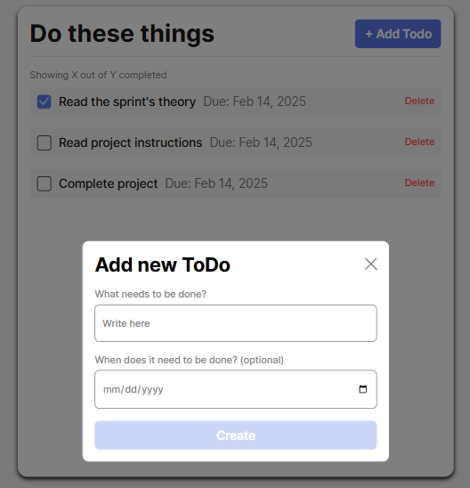
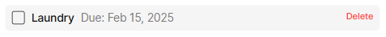
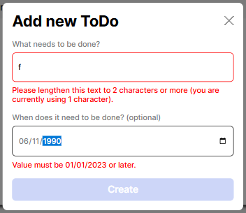

# Todo App

A simple but interactive to-do list application that allows users to add tasks and create optional deadlines. The site features a form for adding new tasks, built-in form validation, and automatic submission handling.

## Functionality

- Users can **add new tasks** via a pop-up form.
- Each task includes a **name** and an optional **due date**.
- The form **validates user input**, ensuring that required fields are filled correctly.
- The site dynamically generates and displays new to-do items.
- The form automatically **resets validation** and **disables the submit button** after submission.
- The modal can be **closed manually** without losing entered data.

## Technology

This project is built using the following technologies:

- **JavaScript (ES6+)** – Core functionality and form validation.
- **HTML5 & CSS3** – Markup and styling for the UI.
- **UUID Library** – Generates unique IDs for each task.
- **Modular JavaScript** – Uses separate files (OOP) for validation and task management.

## Photos

## Deployment

This project is deployed on GitHub Pages:

https://imyellingtibbers.github.io/se_project_todo-app/
